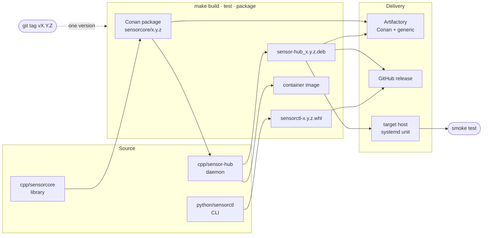

# pet-devops

[](https://github.com/bulbashenko/pet-devops/actions/workflows/ci.yml)
[](LICENSE)

A complete build, packaging and delivery pipeline for a small C++ service and
its Python client — from compiler flags to a running systemd unit on a target
host.

The software itself is deliberately modest: `sensor-hub` is a C++ daemon that
serves deterministic simulated telemetry over HTTP, and `sensorctl` is a Python
CLI that talks to it. They exist to give the pipeline something realistic to
carry: a library that becomes a versioned Conan package, an executable that
becomes a `.deb` and a container image, and a Python distribution that becomes
a wheel — all from one commit, all carrying one version.

## What it does



**GitHub Actions gates pull requests** — lint, unit tests, packaging, a real
`.deb` install check, and security scans. **Jenkins cuts releases** — it
publishes to Artifactory, deploys with Ansible and smoke tests the result.
Neither contains build logic; both call `make`, which calls `scripts/`.

## Quickstart

Assuming Docker or Podman and, on a non-Ubuntu host, distrobox:

```bash
make devbox              # Ubuntu 24.04 toolchain container — once
distrobox enter devbox   # run everything from here
make build test          # compile, run 26 tests, write JUnit reports
```

The full stack — Jenkins, its build agent and a systemd host to deploy onto —
starts from that same shell:

```bash
make up                  # generates the deploy key on first run
make deploy && make smoke
```

| | |
|---|---|
| Jenkins | http://localhost:8081 — `admin` / `admin`, job already created |
| sensor-hub | http://localhost:8080/healthz |
| `make help` | every available target |

## What is actually verified

Nothing here is aspirational — every piece runs:

* **26 tests.** 9 GTest cases on the library, 13 pytest cases on the client with
  mocked HTTP, and 4 integration cases that start a real `sensor-hub` container
  and drive the installed `sensorctl` binary against it.
* **The `.deb` installs.** CI runs `apt-get install ./dist/*.deb` on a clean
  runner, then waits for the systemd unit to answer `/healthz`.
* **The deployment is idempotent.** A second `make deploy` reports `changed=0`
  rather than bouncing a healthy service.
* **The deployed version is checked, not assumed.** The playbook compares the
  version the running daemon reports against the package `dpkg` says is
  installed, so a deploy that left the old process running fails loudly.

## Layout

| Path | What lives there |
|---|---|
| `cpp/sensorcore/` | Library with its own Conan recipe — the package that gets published |
| `cpp/sensor-hub/` | HTTP daemon consuming that package plus conancenter dependencies |
| `python/sensorctl/` | CLI: hatchling + hatch-vcs, pytest with unit and container-backed tests |
| `scripts/` | Every build step, as a script that runs from a terminal |
| `packaging/deb/` | Control file, maintainer scripts, hardened systemd unit |
| `docker/` | Toolchain image, runtime image, Jenkins agent, deploy target, compose |
| `jenkins/` | Controller image, plugin list, complete JCasC configuration |
| `ansible/` | Deploy role: install, configure, restart, verify |
| `.github/workflows/` | The pull-request gate |
| `docs/` | Decision records, runbook, security notes |

## Why it is built this way

Five decisions shaped everything else. Each has a short record explaining the
alternative that was rejected and what the choice costs:

* [Why two CI systems, and which owns what](docs/adr/0001-gha-gates-jenkins-releases.md)
* [Why the version comes only from the git tag](docs/adr/0002-version-from-git-tag.md)
* [Why no build logic lives in CI configuration](docs/adr/0003-logic-lives-in-scripts.md)
* [Why one toolchain image is used everywhere](docs/adr/0004-one-toolchain-image.md)
* [Why the Jenkins controller has no UI-made configuration](docs/adr/0005-jenkins-as-code.md)

Also worth reading: the [runbook](docs/runbook.md) — everyday commands plus the
failures actually hit while building this, with their causes — and the
[security notes](docs/security.md), which are explicit about what is *not*
covered.

## Releasing

```bash
git tag v0.2.0 && git push --tags
```

That is the entire procedure. The tag sets the version of the Conan package, the
`.deb`, the wheel and the image alike; GitHub Actions attaches artifacts to a
release, and the Jenkins job publishes and deploys.

## What runs without secrets

Everything except publishing. `CONAN_REMOTE_URL` and `JFROG_TOKEN` are optional:
without them Conan resolves dependencies from conancenter, and the publish step
reports itself as skipped rather than failing. A fork or an outside pull request
therefore still goes green — which is the whole point of a gate.

Turning publishing on is four environment variables; the checklist is in
[docs/artifactory.md](docs/artifactory.md).

## Roadmap

Honest gaps, in the order they would be worth closing:

* Sign artifacts (cosign for images, a signed apt `Release` file) — today they
  carry checksums only.
* Replace the hand-built `.deb` with debhelper once the payload outgrows one
  binary and one unit.
* Multi-architecture builds (arm64 alongside amd64) via a Conan profile matrix.
* Gate on Trivy HIGH/CRITICAL with a documented exception process.
* Coverage and sanitizer (ASan/UBSan) jobs in the pull-request gate.

## Licence

MIT — see [LICENSE](LICENSE).
